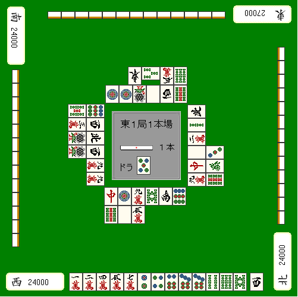

# 防守 6—弃和的切牌顺序（1）
弃和的切牌顺序（1）：  弃和有着明确的切牌顺序，所以弃和要按照切牌顺序。这样放铳率才会大幅下降。

弃和的基本思路

 从安全度高地牌开始切。  这是弃和的原则， 即使拆散手牌也不要紧。 因此，有“现物”，或者场上已经切了三张的字牌等“完全安全牌”的话，首先就切这些。 从已经通过的牌开始切，这个是非常重要的。 一巡中有可能现物会增加，也有可能他家放铳，还有可能立直者自摸等等情况出现。 明明有现物的时候，却从“一眼看上去貌似能通过”的牌开始切， 从防守的观点来看都是有损失的。

 现物的优先度

 如果有多张现物的话，切牌也还是有顺序的。 这个顺序就是“将来可能有危险的牌先切”。

这里手牌很烂，这个时候和亲家对日的话 就好像日本向美国挑起战争一样愚蠢。  5万、6索和西是安全牌。 5万和6索切哪张都没什么问题，不过切西的话就是一个切牌顺序的失误了。  这里要是有人追立的话，安全牌就全没了。 下家突然切出一张无筋的3饼， 很有追立的可能。  毫无悬念，这里应该切掉5万或者6索。  理论： 有多张现物的时候，应该保留共同的安全牌。  下一回我们讲手牌没有安全牌的时候该怎么办。  （待续）