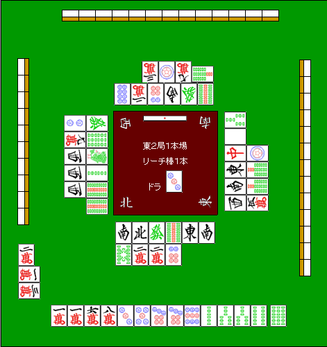
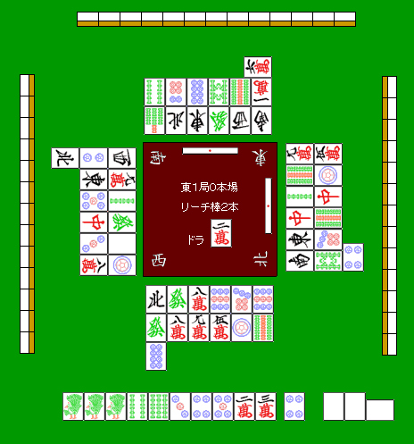

# 防守 8—弃和的切牌顺序（3）
弃和的切牌顺序（3）：  我们来看一下实际的例子吧：

例 1：旁边的
两人貌似已经弃和了，所以这里已经到了全面弃和的状态。  安全的牌一次是：1 万→9 饼→6 万→7 饼 如果现物没有增加的话，就按照这个顺序切吧。  1 万几乎是完全的安全牌。 即使 NO CHANCE,而且第三张只能是七对子等单骑听牌才可能放铳。 被鸣掉的牌大家不要看漏了。  接着就是筋牌 9 饼和 6 万。 由于 6 万有嵌张的可能，而且还会附加断幺的手役，所以一定要从 9 饼开始切。  如果没有筋牌的话，那就只能拆掉 7 饼的对子了。 其理由是，对家较早打出了 6 饼，7 饼多多少少还是安全的。 而且通过一张的话，另一张也能够通过。

例 2：
 这是进入终盘是，连续两家立直的局面。 面对两家立直的时候，如果没有共有的安全牌，可以切掉其中一家的安全牌。  不过，亲家的唯一现物是 4 索，这对下家来说是非常危险的牌。  然后这个无筋的 4 饼在亲家的一发巡目里，也是切不得的牌。 “上家立直的现物，这里亲家应该不会立直吧”，这么想是很危险的。  亲家的筋牌 3 万，由于是宝牌周边，所以也是很难切出手的牌。  牌已经切掉第三排了，这个时候的 ONE CHANCE（3 饼）也是完全不能相信的。  下家早巡切掉了 2 索，而且对于亲家 1 索是相对安全的牌。所以这里我推荐 1 索的三连切。  理论： 距离立直宣言牌越远的那张数牌的外筋是安全的。

随着弃和的增加，这个理论可以说是意外的实用，所以我们需要记住。  比如 2 万和立直宣言牌距离越远，1 万的安全度就会越高。  如果对手有 223 万这样的型，在早巡也是不会先切 2 万的。 就算他切了，在立直之前也很有可能先把这个面子做好了，然后去听别的牌。   （待续）