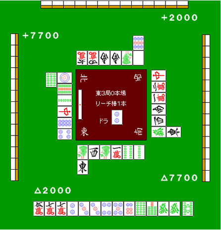

# 防守 9—兜牌

兜牌：  兜牌即一边扣住危险牌，一边向着和牌或者是听牌前进的打法。  一般情况下，对手立直之后：  1.自己没有听牌也要向着听牌或者和牌前进。 2.如果对日对自己不利的话。即使自己听牌也会拆掉手牌。  这样的情况就出现了“兜”这个选择了。  具体的说就是： 拆对子、拆搭子、拆暗刻、七对子 4 种方法。

 拆对子

 这是兜牌的常用手段， 通过一次的话，第二次也能通过。而且不会拆乱自己的手牌。  例 1：

 比如这样的例子，这是一个很能体现兜牌效果的例子。 弃和去切掉 4 饼和 6 索实在是太可惜了。 一发打 3 饼确实有点危险。 这里切掉已经打出 1 张的發是好手， 能够做成门断平宝牌 1 追立的话是很理想的。

 拆搭子

 我们再来看具体的例子吧。

 要是没有人立直的话应该拆掉 24 饼的搭子。（全攻的时候就该这么打） 兜牌的话，这里应该切掉 2 万。神进张摸到 3 饼的话就立直。  一向听的话，摸到 5 饼什么的，可以可以考虑切掉筋牌的 3 万。  同样是兜牌，这里打 4 索就是恶手。 不仅宝牌是 2 索，作为胜负牌的 3 索是非常危险的。  要拆掉搭子兜牌的话，就需要保证两张牌的安全。  上面虽然这么说，不过切掉 2 万之后摸到危险牌的话，拿还是快快弃和为上。

 拆暗刻

拆掉 3 张安全牌的暗刻时，也还是可以让手牌有所进展的。 在这三巡里能够通过的牌增加的话，偶尔还是可以向和牌前进的。

比如这样的手牌，拆掉西的暗刻。 偶尔最后还是能以食断和牌的。

 七对子

  这是一个缺少确实性的方法，大家有没有面对立直弃和的时候，不知什么时候手牌居然七对子听牌了呢？  比如役牌是宝牌，用不上的牌却又打不出去，同时自己有非向着听牌前进不可的时候。那就只能霸王硬上弓强凹单骑听牌了。  这个时候七对子是可以放手一搏的方法。

 兜牌需要注意的地方

  兜牌是应该在“能兜牌”的情况下使用的。 本来有和牌希望的牌也应该弃和；有些苦逼的牌也必须放手一搏。 这些都要根据自己的点数情况来进行判断。  “能兜牌”的状况是不确定的。  不要忘了防守的基本是“弃和”。   （待续）