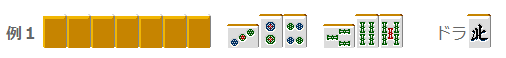
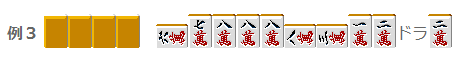
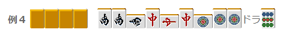
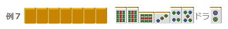

# 防守 10—副露的防守

副露的防守： 面对立直的防守，谁都能够做到一定的程度。 但是对副露的防守还有很多人有所不足。 这个本来是预定到第八章在说明的，不过在这里简单说说吧。

首先是读听牌

 对手还没有听牌的时候弃和是没有意义的。 所以副露防守和立直不一样，看穿对手是否听牌的技术是必须的。  （1）三幅露可以视作听牌 “三幅露却没听牌”是很少见的。 即使对手是新手，三次鸣牌 90%都已经听牌了。  （2）所染手的牌出现多余多半已听牌 比如做索子混一色的对手的索子多余了， 不是听牌也是一向听了吧。  （3）所切牌看起来很恐怖的话多半已经听牌 这在实战中是很重要的。 平时打牌不怎么在意对手切牌的人需要特别注意。 没有这个习惯的人很喜欢在听牌之前只看自己的手牌。 把自己的目光放在对手的切牌上，有时能够大致看破对手所听的牌。  （4）反复的毫不犹豫地摸切也是听牌的迹象 平时切牌需要花点时间的人，突然一下子就把牌切了。这应该已经听牌了吧。 特别是那种总是把摸来的牌放在牌最边上，确认牌之后马上切掉的人是最可疑的。  就是这样，3 和 4 如果感觉比较难掌握的话，那么就要注意 1 和 2 了。

推测打点高还是低

 如果是 1000 点的断幺，完全没有必要去防守。 我们要避免无意义的弃和。  基本的就是宝牌。 碰了宝牌的人打点肯定高，能够达到满贯以上。 这是理所当然的，需要特别重视。

 假如北是宝牌，南家这样副露的话完全可疑无视。 完全是一个 1000 点的断幺。

 虽然这样手牌的概率并不是零。 不过这个可以根据场上切出的役牌进行确认。 如果南家连北都切了，就没什么好怕的。

 假如 4 饼是宝牌，而且亲家是这样的副露。 双东宝牌 1 确定，一定有 5800 点。 还是尽量不要去对日了。  染手往往都是大牌， 特别是清一色或者与宝牌联系的混一色。常常能够达到满贯或者跳满级别。

 这样的副露的话毫无疑问， 把万子扣住然后弃和。 当然役牌也是很重要的。

 南场，恐怖的副露。 完全是除了现物其他牌都切不出去的状态。 这里要不惜拆掉手牌进行弃和。

 危险牌是哪些？

 麻将并不是说对手每次鸣牌都要弃和。 除非对手鸣了三组役牌或者杠了宝牌之类的情况， 还不用着拆掉面子进行弃和。 只要把有一定危险度的牌扣住就好。

比如例 5 的牌，明显發是危险牌（笑） 虽说大三元的概率很低， 但是中巡以后發就是一张打不得的牌，要是铳了的话就是一个字——死。

 这个十有八九是对对，场上一张没切的牌（生牌）都危险。 特别是役牌切不得。 有可能是单骑听牌，把字牌都看做是危险牌吧。 特别是三幅露之后手切的时候，有可能换听双东 NOMI。 甚至有可能是单骑听牌。

很像后附的鸣牌， 需要注意役牌的生牌。 当然对手有役牌暗刻也是很常见的。

 这种后附宝牌 1 或者宝牌双碰是很常见的，放松警惕的话是容易被日的。 用两面来进行后附的对手，我们应该按照他有两张宝牌来处理。

  （待续）