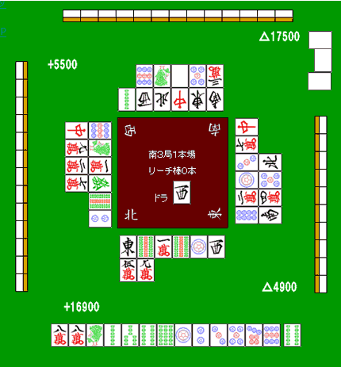
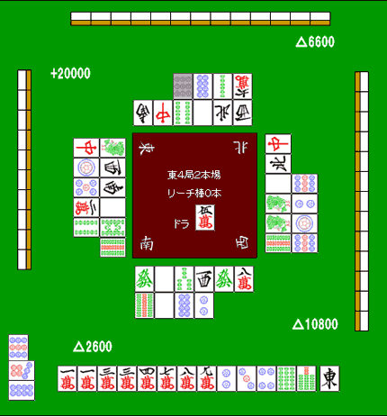
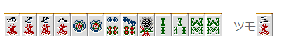
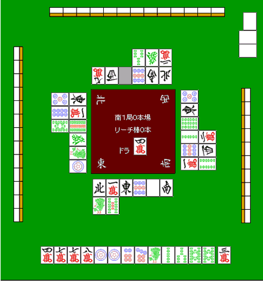

# 防守 12—扣牌（2）
扣牌 2： 我们来看看扣牌的具体例子。

下家染手

 扣牌很多时候都是在下家染手时进行的。 这个例子，很明显下家是索子的一色手。

而且，他现在是亲家，自己在南场是 TOP。 现在亲家应该还没有听牌吧，这个时候就应该把索子扣住了。  自己虽然是一向听，但是是无役的愚型。 即使听牌也是很不想切掉索子的。  虽然切饼子维持一向听也是一种打法。 但是 9 饼有两家切掉了，以防有人立直是应该留下的。  这里应该拆掉 8 万的对子，把索子紧紧扣住 施行让亲家未听下庄的战术。

后付的字牌

 亲家用两面进行了副露，这个时候摸到了东。 我觉得这张东是绝对应该扣住的。  从亲家副露来看，有可能是混一色、一气、789 三色、全带 但是这些可能性很低，从场上的舍牌来看只可能是双东了。

 这里切 1 万，千万不要切东。博形听也好，弃和也好。 总之只能从这两者之间选择。  BOOM= =，一下子把东打出去的话就太勉强了。 切不得的东西就不要切。 要是再让 TOP 的亲家继续扩大优势的话就很不妙了。这里心中要有将扣牌进行到底的觉悟。

攻守兼备的扣牌

要是纯粹的何切问题，这里从牌效率以及摸到 4 索可以走断幺来考虑 切 1 饼是绝对的答案。 但是，这样的情况怎么样呢？

 下家的副露听牌与否以及打点多少都还不清楚。 但是切掉 1 饼的话，不能无视下家会吃得概率。

 虽然下家吃自己不会损失点数。 点数是没损失，不过他就距离和牌又进了一步。 自己失去亲家的可能性就变高了。  与其考虑这个能包含宝牌以及断幺的可能性，我觉得先注意一下下家的副露会比较好。  切 8 索的话，下家应该不会有什么动静。   （待续）