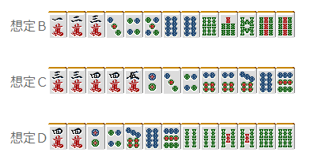
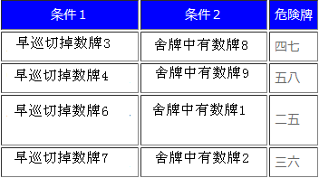
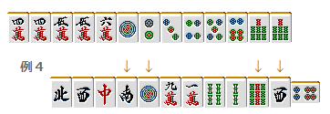

# 防守 14—立直的读牌（一）

立直的读牌 1： 虽说是立直的读牌，并不是传说中读出对手听什么牌的高难度技术。 毫不夸张的说，读出立直者听什么这是不可能的。

比如例 1 的立直的手牌一向听的情况如图所示（假设）。 但是，我们是不能断定立直时所听的是什么牌。  摸到 14 万的话就听 69 索； 摸到 69 索的话就听 14 万。  听牌时的有效牌叫做“入目”，

正式因为有了入目，所以不能够做到一点读。  而且本来例 1 的手牌，除了现物之外，其他的牌危险程度都差不多。 随便给几个例子吧。图 B~D 的情况都是不能否定的。

结果就是，不要有“去判断立直者听什么”这种错误的想法。 “立直的听牌是不能读出的，也没有必要去读”，这个认识是立直读牌的第一步。  这样一来，我们读牌到底读什么呢？ 其实是“牌的危险度”和“牌的安全度”。  能够在攻守两方面灵活运用读牌，我觉得就是一位一流的雀士。 特别是寻找安全牌的技术是非常重要的，这对放铳率有着很深的影响。  理论、总结： 读出立直者听什么牌是不可能的，也没有这个必要。 对于有一定舍牌特征的立直，能够把握“危险的牌”和“相当安全的牌”才是真正的读牌。  下面，举几个“危险度比较高的牌”的例子。

五的里筋

有关里筋其他很多网站有许多记述，这里就不再详细说明了。 在实战中，里筋危险度比较高的就是“五的里筋”和“间四间” 过去常常说“早巡切 5，就很可能是 14 或者 69 听牌。” 虽然还不知道统计的结果，不过这也是可以容易感觉到的东西。

例 2 的手牌，比较早得切出了 5 饼是一个特征。 9 饼已经被切出了，所以 14 饼的危险度就比较高了。 实际的手牌如下：

当然听索子或者万子的可能性也是很高的， 但是 14 饼也要看做是危险的牌。  “早巡切了数牌 5”这是非常重要的信息。 正是因为早巡切了利用价值很高的数牌 5， 所以不难想象，他手牌里有 23 或者 78 的搭子。  即使是立直时切出数牌 5， 我们也很难判断是以什么牌型切出来的。 是浮牌？还是 57 搭子摸到 8 之后才打出的？还是 455 切掉 5 来固定两面？ 总之有着很多的可能性。  例 2 立直时切出了 5 索， 但也不能说 69 索比其他无筋的牌要危险。  总结、理论： 面对早巡切出了数牌 5 的立直， 就应该警戒数牌 5 对应花色的 14 和 69.

间四间（注：有关间四间，在福地诚与凸东北撰写的《科学麻将中》指出了其错误性，这里各位读者可以查阅资料了解。）

  间四间读作“aidayonken”,有以下四种情况。

 两张相差 5 的数牌的里筋就叫做“间四间” “早巡切掉”是关键词， 利用度比较高的 34 和 67 在早巡被切出是间四间的一个条件。

（之后是摸切） 序盘是字牌的连切，所以第七巡的 7 万可以说是切的比较早的了。 而且 2 万也被切过，这里 36 万是万子的本线。 饼子和索子这里没有什么判断的材料，只能够认为所有的饼子和索子都是危险的。  实际的手牌如下：

（之后是摸切）  有一个常常被误解的东西，这里需要事先说明以下。 例 4 中 58 索是间四间的危险牌， 但是终盘切出的 6 饼并不能说明 25 饼是危险的。  如果是单纯的 346 饼的话，6 饼应该被更早切出。 间四间确实是危险的， 但是不能正确掌握间四间的条件也是毫无意义的。

 被拆掉的两面搭子的里筋

 这是由“二度进张不利”的牌理反过来推导的逻辑。

（之后摸切）  例 5 的立直很显眼的地方就是拆掉了 23 饼的两面搭子。 “正是因为拆掉了，所以才不会是 14 饼听牌啊”，这样的想法只是初学者的天真想法…… 实际上 14 饼才是关键啊，不是吗？

想象一下 A 和 B 的两种牌型吧。  正是想避免二度进张，所以才拆掉了 23 饼的搭子。 留下了 146 饼听牌的可能性。 这种拆掉两面搭子的立直，一定要对其筋保持警惕。  总结、理论： 拆掉两面搭子的立直，要小心其二度进张。

 拆掉嵌张搭子的立直的跨筋

  这种情况的条件比较复杂，但也是危险度非常高的情况。 从外→内拆掉嵌张搭子的立直，跨筋是危险的。 用文字说明有点难懂，我们来看看实际的例子吧。

（之后摸切）  一眼看去没什么特征的舍牌，虽然无筋的牌都狠危险。 但是有一组危险等级更高的筋。  那就是 25 万。下面来说明理由。 这个立直拆掉了 13 万的嵌张搭子。 但是中间切掉了 5 索和东，所以不是单纯的拆掉嵌张搭子。 没有留下安全牌东，是因为手牌的需要。 也不像是摸到 4 万形成两面，因为要做两面的话，5 索要优秀一些。 也就是说，从 334 万这种形里切出 3 万的可能性是很高的。  这种情况要是条件没有齐，或者是远离立直宣言牌拆掉的嵌张搭子，跨筋也不是那么危险的。  对立直危险牌的读牌这样的程度已经足够了， 更重要的还是下一节的“安全的情况”。

防守 15—立直的读牌（2）

立直的读牌2：

对于立直，读安全牌比危险牌能够有更高的精度。
当然麻将中不会放铳的牌比会放铳的牌多得多，所以读牌的有效度比读牌本身要有意义的多。

这也就是为什么再迷彩战术被淘汰的今天，更重要的是要磨练寻找安全牌的技术。

 安全牌前的跨筋

 稍微有些经验的雀士，拿着安全牌都有些模式化。
在听牌前不会拿着多余的牌，摸到安全牌的话就把它留下。
反过来，听牌之前不会特意减少进张来留安全牌的。

这个就可以利用到读牌中。

这是切安全牌的立直。 完全不能确定危险牌，但是安全度比较高的牌可以很容易的找到。
89万基本上可以通过；1饼和9索也有很大概率能够通过。

比如这样的一向听，你们会减少进张留下安全牌吗？
虽然不能说“绝对不会有留下安全牌的人”，但那也只是极少数的人。

切掉安全牌的立直，是由两个固定的两面搭子来的。
不会有双碰进张，记住这个就好了。
（但是，如果场上已经切掉了2张7万的话，这个的可信度就会大幅下降了）

立直之后5万通过了，这样一来8万应该是一张安全牌。
通常来说，5万通过了，还有双碰或者嵌张听牌的可能性。
虽说不可以掉以轻心，但是把8万当做安全牌立直的话就是另外一回事了。
很难想象对手会把嵌张留下让自己的进张变得更窄。
就好比788万的形，先切掉7万一样。一定会被别人看做是“怪人”的。
同样，1万和7万的中间筋4万的嵌张听牌也不可能，这张牌的安全度相对较高。

像这样，立直的宣言牌是安全牌的时候，这是非常重要的情报。
好好利用可以提高自己弃和的精度。

总结、理论：
切安全牌立直，
宣言牌的前一张牌可以看做和铳牌没有关联。

逆切的跨筋

没什么特别之处的立直，
那么，我们还是能够找到除现物之外的安全牌。
重点就是拆掉了嵌张搭子，所以3索是安全度比较高的牌。

首先来看看两面的安全度吧。
如果是4557索的形，那么应该先切掉7索留下5索的双碰进张。
那么切牌的顺序应该就是7索→5索。
正是因为这样，所以单纯的36索听牌是不可能的。

由于舍牌中还有2索，要是双碰、嵌张或者单骑听牌的话，这个2索就是让人难以想象的舍

牌了。

唯一符合条件的就是这样的形，就会从5索→7索这么切了。
这样的话就是369的三面听牌了。

我们只要记住：“拆掉嵌张搭子的立直，逆切的筋除了三面张之外，几乎是不会放铳的。”
但是，需要注意的一个情况就是摸切。

这里的7索要是摸切的话，这里听36索是很有可能的。
这里不能否定第6巡的5索是固定两面的可能性。

假想图：
 在上级者的对局中，仔细观察对手是手切还是摸切，
能够将这个读牌最大限度的利用。

总结、理论：
拆掉嵌张搭子的立直，逆切的筋牌安全度较高。

双碰、嵌张的否定

在这里我想稍微补充一下有关双碰和嵌张听牌的安全牌读法。

双碰的否定可以根据“两面搭子不会故意做成双碰”这个基本的牌理实现。

有关例4，来说说5饼和7饼。
“即使是嵌张听牌也不可能是双碰听牌”455饼会切4饼吗？

778饼会切8饼吗？
稍微会打一点麻将的人都会选择双面进张的。

由于还有嵌张听牌的可能，所以5饼和7饼不能说是安全牌，
但是之后的现物中4饼或者8饼能够见到4张的话，
就能够否定嵌张听牌了。

像这样，读牌和 NO CHANCE 两者结合
也能够找到能够通过的牌，在实战中这是非常有用的技术。

嵌张的否定也是同样的，“两面进张不会故意选择嵌张进张”，就是这个逻辑。

这样的立直，要是8饼能放铳的话，估计也就是七对子了。
5679饼或者5688饼的形，是不会故意拆掉5饼和6饼的。

最后简单介绍一下关于宝牌使用的读牌。
这样的立直，两筋引挂是嵌张听牌中最应该警戒的了。
但是这个立直，嵌6索是不可能的。

的形，选择宝牌听牌的人占多数吧。
有赤牌的话

的形就不会先打3索，而是先打9索了。
有断幺手役的话同理。

宝牌周边的牌是危险牌，这个自然不用说。
但是，从没人会故意降低自己的打点这个角度看，
我们有时也能意外地发现一些安全牌。

这些只是读牌的一些例子，寻找安全牌的方法还有很多
至于其他方法嘛，我希望各位在实战中能够自己发现。

（待续）