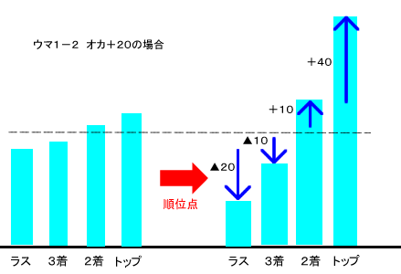

# 状况判断 2—要有顺位意识

要有顺位意识：   为什么点棒状况很重要呢？ 这是因为麻将中有 马和头名奖两个顺位点的原因。  马  马其实就是，半庄结束时根据顺位每人必须支付的点数。 大多数的场合，采用以下3种形式。  ·5-10  ゴットー（四位支付给一位10000点，三位支付给二位5000点） ·10-20 ワンツー （四位支付给一位20000点，三位支付给二位10000点） ·10-30 ワンスリー （四位支付给一位30000点，三位支付给二位10000点）  头名奖  头名奖是麻将中一次比赛给予 TOP 的奖励点数。 麻将中30000点原点，一般情况下每人所持点都是从25000点开始的。 这中间所差得5000点就全部由 TOP 获得。 简单的说，拿到 TOP 的话，就可以额外获得5000*4=20000点的点数。  这样一来的话：

 最终结果就会像上图这个样子了。 根据规则，麻将的重点（即收支），对局后根据顺位的点数加成要比游戏时的点数（所持点）更加重要。  这是这样，对局时注意4人点数的意识是必要的。 到了南场，4人的点数有差距时 “自己的目标是第几位？”这个心中要自己有数。  特别是 TOP 的顺位点很大时， 就要抱着“TOP 以外都是没价值”这个想法了。 尽全力以 TOP 为目标来打牌。  网络麻将的 Ranking（排位）采用了顺位的算法。 即只根据顺位来进行成绩的判定。  不要忘了麻将是比顺位， 要根据状况来打牌啊。  第四有第四的打法、TOP 也有 TOP 的打法。    （待续）