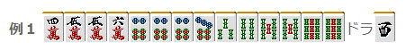
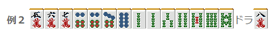
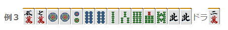
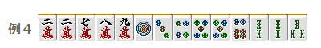
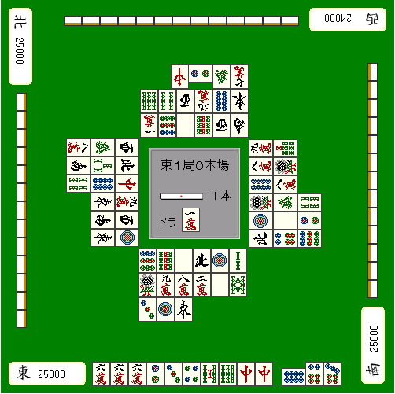

# 状况判断 3—状况与做牌（1）
状况与做牌1：  做牌可以参考巡目来进行。 巡目可以根据舍牌的排数为目标：  序盘（1~6巡） 中盘（7~12巡） 终盘（13~18巡）  分为这3个部分就行了。  【基本的想法】  序盘追求手役的可能性，追求好形。 中盘首先考虑听牌，根据自己的手牌同时为他家的进攻做准备。 到了终盘自己的手牌没有战斗力就要重视防守了。  我用具体的例子来说明吧。

比如这个手牌，切7饼追求万子和索子的靠张立直是没什么漏洞的打法。 要是序盘的话，为了追求打点可以拆掉9索的对子。

 例2不去听牌切掉8索是很正常的 5饼~9饼之间，摸到任何牌都可以形成好型听牌。 索子的变化也还有很多。 但是中盘以后，饼子变得比较薄，手牌的变化没那么值得期待了。 这个时候就切掉6饼听牌吧。  可以期待改变索子的形，或者摸到宝牌形成三色。 有时候还可以根据索子的舍牌情况，直接立直。

 例3仅仅从牌效率来说，切掉北是最好的 因为损失只有“北”而已，这个应该没什么异议吧。 但是中盘之后，比起牌效率，我觉得应该更优先防守。 留下安全牌的北，打饼子会比较好。  终盘的主题就是形式听牌 舍牌到了第三排，比起和牌，应该优先形式听牌。

 要打平和的话，就切2索。 但是要想形式听牌的话就只能切1饼。 吃只能吃上家的，但是2万和2索的碰可以从3家来。 要想听牌的话就切1饼吧。

 这是个终盘有一定高度的技巧。 例5是一个在有人立直的情况下形式听牌的例子。  上家切出4索，中已经切出了2张。 这个牌当然是和不了，不过你就会这样放过去摸牌了吗？  这里应该吃4索，然后切中。 这样即使下一巡摸到危险牌也可以再切掉1张中维持听牌。

 （待续）