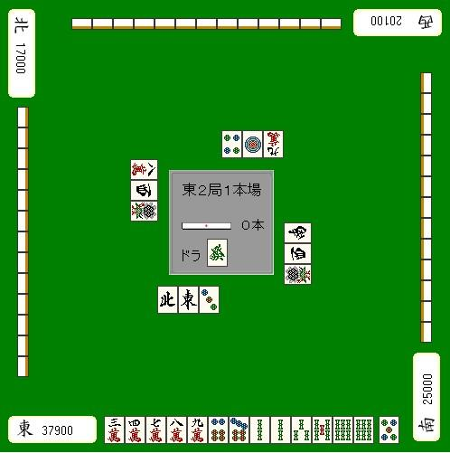
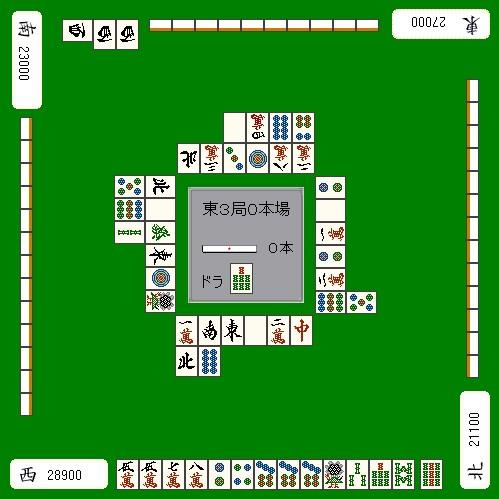
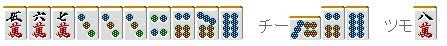
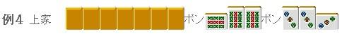
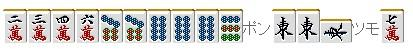

# 状况判断 4—状况与做牌（2）

状况与做牌2：
下面，我们结合场况来看看怎么做牌。
有时候我们应该注意那些被打掉的和被鸣掉的牌，“结合场况来做牌”。

对比较薄的牌的对应

观察切掉的牌，可以知道自己需要牌已经被打出了多少。
这是状况判断基础中的基础。
例1：

例1应该拆掉哪一组索子的两面搭子呢？
答案就在场上了，显然应该打3索。

对较强的花色要有意识

例2

亲家客风副露，有索子混一色的迹象。
自己完成了一组宝牌面子进入了一向听。
由于面子超载，所以这里要选择拆掉饼子或者索子的一组嵌张搭子。
两个搭子需要的牌外面都只切出了一张，但是需要注意的是整个场面饼子和索子切出的总数。
饼子被切出了这么多，说明其他家手里并不怎么需要饼子。
反过来也很容易地可以推测出索子在他家手里用的比较多。

这种场上切出很多的状态叫做“安场”（注：这是我按字面意思随意译的，有更专业的说
法请指教，原文 場に安い ）
场上没怎么切出牌的状态叫做“高场”（注：同上，原文 場に高い ）

一般情况下，听安场花色的牌更加容易和牌。

即使嵌3饼小于三张的时候也可以说是比较好的听牌。
不仅安场花色的牌其他家难以用上，而且也容易形成 One chance 和 No chance。比一些张数更多的听牌和出的可能性还要大。

所以这里拆掉13索的搭子是好手，过分提防亲家的染手而去拆掉饼子就有点小鶸了。
如果听嵌2索立直的话，由于所听牌和亲家所染的花色一样
根本别期望其他两家会打出来。
亲家也容易扣住你的牌，是很危险的。

副露的对应

自己的手牌
 面对这种全带系的副露（如果哪一边都不安全的话）
自然必须从5万那边开始切。

自己的手牌
 赤裸裸的对对副露的话，自然没有出现过的牌危险度比较大。
例4要打的话就打7饼。
如果8饼能看到3张，而场上一张9饼都看不到
有谁在做对对的这种想法也是很自然的。

（待续）