# 状况判断 5—状况与做牌（3）
这一节来试试结合点棒状况进行做牌。
原点以下注重打点，原点以上注重速度，这是比较基本的考虑方法。
提高打点

虽说要提高打点，但是老是过于勉强地去做手役，和上位的差距会越来越大。
1.门清立直 2.用宝牌 3.混一色 4.这三个就是提高打点的核心了
例1：
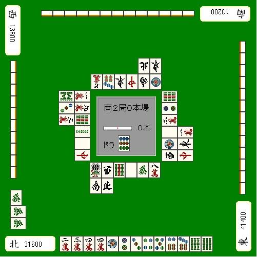

想要高打点，立直是最近的一条路。
例1虽然赢了点点棒，但是现在正在和下家争 TOP。吃了上家的3万也许要和牌是没什么问题，
但是和 TOP 的差距是基本没缩小。
这种情况是应该要凹门清立直的牌。
当和自己争 TOP 的玩家是亲家时，用食断等小牌让他安全下庄，你这是没搞清楚情况吧= =

总结、理论：
自己的目标是亲家时，以打点为重是基础。

例2：
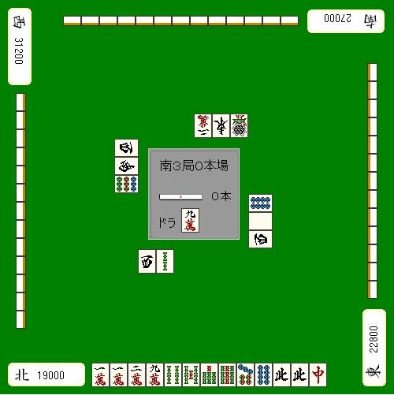

想要副露提高打点的话，强行地使用宝牌也是一招。
像例2这样的四位需要打点的情况的话，

吃这张9饼向全带方向进军是比较有意思的。
目的就是为了强行用上宝牌的9万，做成“全带三色北 DORA1”或者“全带北 DORA2”的满贯。
虽然说这个副露也许有点远，但是比起门清，这样副露和满贯的几率不是要高一些吗？

自己四位的时候，失去打点与速度平衡的人往往比较多。
哪怕自己多么想要打点，例3也只有切6万这一手。
如果自己不想和小牌的话，不鸣牌就可以了。
门清立直的话，哪怕切掉一张宝牌也有5200点，自摸的话毫无疑问的满贯。
非常不推荐切掉3饼确定宝牌的对子。

提高速度

这种牌切掉2饼进入平和一向听是比较通俗的打法。
但是如果是南3局，自己 TOP，无论如何也想让牌局前进的话。
拆掉宝牌对子就是很巧妙的一手。

当然，既然切了宝牌，2、5万；5、8饼的吃听可不要错过了。

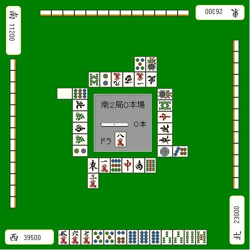
例5

对自己 TOP 地位威胁最大的就是现在处于第二位的亲家。
绝对不能让他连庄。
通畅情况下应该立直的牌，这里也要副露从而阻止亲家连庄。
因此，这里应该碰5饼听牌。
至于听牌的选择嘛，选择容易被打出的6、7饼比较好吧。

状况判断 6—状况与立直判断
第六章已经讲过，听牌的话几乎都应该立直。
这一节就要讲根据场上状况，讲几个“应该立直的牌默听”或者“不要去默听”的情况。

翻山的宝字牌单骑

假如自己有例1这样的七对子听牌的手牌

当然是选择听宝牌比较好，
不过假设现在上家刚刚打过中，
这种情况下，保持1~2巡的默听是比较优秀的战术。
既然中没有被碰，
那么下家或者对家最多也就拿着一张。

有时候中盘以后手里有宝字牌会使自己的手牌进张比较窄，
常常会有“想切切不得的”的状态。

不过要是有人切了宝牌，常常有人就会跟打
我们的针对的就是这些跟打。

但是如果1~2巡之后都还没人打宝牌的话，
要么是他的手牌不会切出宝牌，要么就是他根本就没有宝牌。

这个时候默听也好，赌自摸立直也不错。

立直的现物

例2
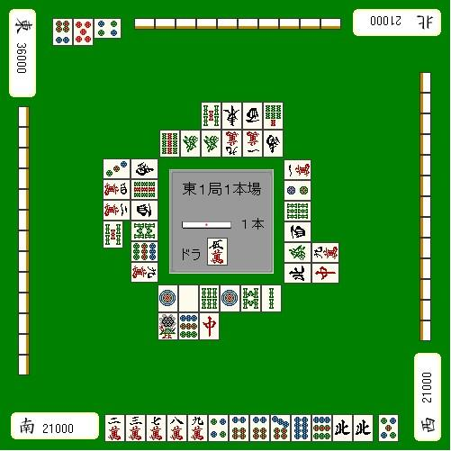

比如这样的状况默听1、4万，要是摸到上家的危险牌就龟缩的战术比较不错。
这样的手牌对日是需要禁止的。

即使立直打点也很微弱，
要是日不过亲家放铳的话会给自己造成致命的一击。
即使自己听的是对方的现物，不过要追立的话
至少也要2翻以上的好型听牌。

南场的立直判断

到了南场，点数状况变得很重要。
例3
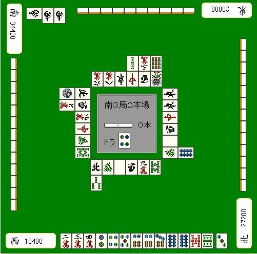

南场4位决定胜负的一打，
这里还是立直的一手。

所听牌比较难打出、默听也能有满贯这些确实也算是默听的理由。
但是注意点数状况的话，这里想要不只是满贯，而是自摸的跳满。
立直之后亲家很有可能会对日，下家根据自己的手牌也有对日放铳的可能
哪怕全体弃和，也还可以赌自摸4、7索嘛。

例4
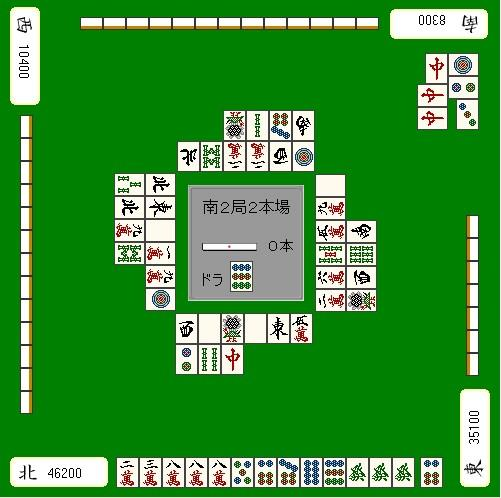

南2局，自己是 TOP，下家目前正在猛追。
看这情况，下家明显是饼子的染手。

场上能看到四张2万，也就是说1、4万是“绝听”
毫无疑问这里应该切5饼，但是立直急需自重啊。

不管你是多么好的听牌，一旦立直的话
点数落后的两家很有可能弃和，从而把1、4万都扣住。
这个状况下，让亲家下庄是比什么都要优先的。
妥妥地和牌才是最重要的
现在想要的不是满贯，即使只有3200点也要下定决心打下去。

后面的情况，虽然可能性很低

摸到6饼还可以打8万。

如以上的例子，南场是需要有顺位意识来进行判断的。
下一节我们来讨论最重要的 ALL LAST 的状况判断。

场上能看到四张2万，也就是说1、4万是“绝听”
毫无疑问这里应该切5饼，但是立直急需自重啊。

状况判断 7—ALL LAST 的战术（一）
ALL LAST（后文简写 AL）是最考验状况判断力的一局了，
首先，正确的把握“这一局要和多少点才能确保几位？”是不可或缺的。

自摸缩小的点差

AL 时亲家和牌逆一，也许我们只会说一句“诶？这就逆了吗？”
但是子家 AL 听牌时想想自己的牌是否到了能够逆转的程度是非常必要的。
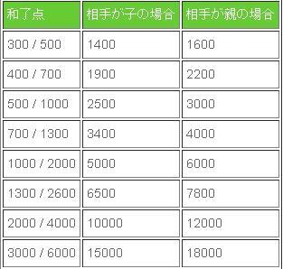

（译注：这个图说明一下。上面的点数是说明子家 AL 自摸能够逆转的最大点差。比如，自摸30符1翻的300/500，那么想要逆转的目标如果是子家，你和他的点差必须在1400点以内，如果是亲家，你和他的点差必须在1600点以内。自摸1000/2000，那么想要逆他，和子家的点差必须在5000点以内；和亲家的点差必须在6000点以内。）
特别是1300/2600是经常遇到的情况。
亲家和子家的自摸缩小点差最好能够背下来。

另外，还有比较重要的就是满贯自摸能够缩小的点差。

“满贯自摸就能够逆转”的点差，还是当做理论记住比较好。（译注：简单就是说满贯理论。很多地方也有说倍满理论的，即一般情况下 AL 自摸倍满即可逆一。好吧，我看你能自摸倍满多少次= =）

满贯直击或者跳满自摸也不是那么容易成功的，

因此“满贯自摸”才是比较现实的逆转手段。

反过来，打牌的重点就是在“满贯自摸的逆转圈内”迎来 AL，或者在“满贯自摸的逆转圈外”迎来 AL。

逆转的做牌

虽说是 AL，也不要特别的去争强好胜。
但是一旦机会来了，就不要轻易错过。

例1：

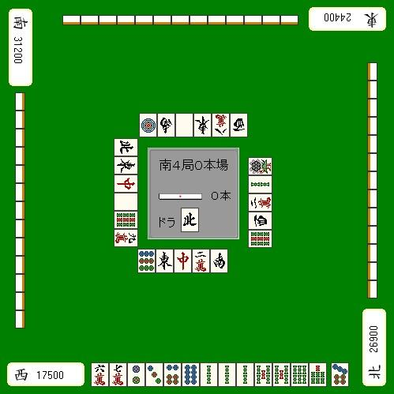

通常情况下重视速度的话，这里切5索就好了。
但是眼下自己是4位，满贯自摸就能逆2，能有跳满就能逆1。

这种情况的话，除了拆2、3饼就没别的选择了。这牌还可以做下去。
但是呢，这牌也不一定就能够成三色，
所以要是有断幺手役听牌的话，
就立马立直，期待一下一发、赤牌或者里宝比较现实。

例2
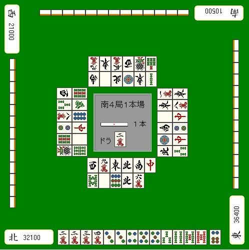

这个问题很简单，
和 TOP 的点差只有4300点
场上还有一根棒子，所以只要一个3900点就可以逆1了。

因此这里切掉宝牌，
能鸣的牌出来就副露听牌即可。
现在可不是做断平三色一杯口的时候。

鸣牌判断

和牌就能够 TOP 的情况，只要重视速度就好了。
后附，食断都可以。
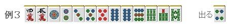

比如 AL 自己是 TOP，和2位只有一点点差距，无论怎样都想逃脱的状况。
这种情况，可以先不管手牌的型，向着和牌前进。
因此，上家要是打出4饼，果断吃之。

例4
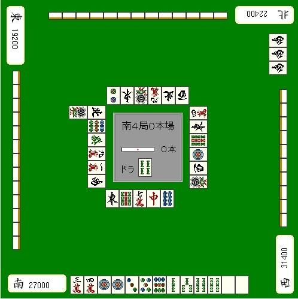

AL 和 TOP 点差4400点，
1000/2000自摸或者3900点的直击能够逆转。

也就是要坐3900点的牌，说直白点就是白、宝牌2。
这样的话，1索就是急需的牌呀，
4家都很重视的 AL，就算是役牌后付也很难被阻止了。

下家已经副露了，时间已经不多。
荣和3900也许还不足以逆转，
但是也不能小看摸到赤牌或者对家扔出立直棒这种偶然的因素。

我觉得这里果断地吃是比较好的。

（待续）