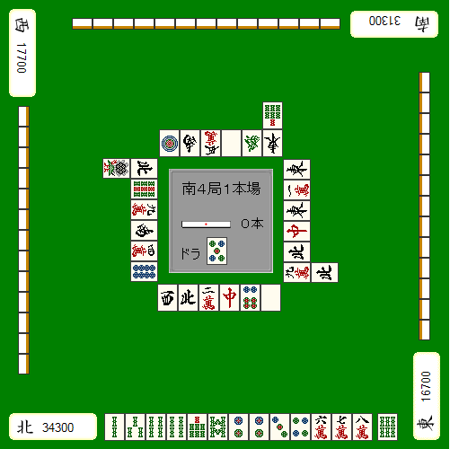
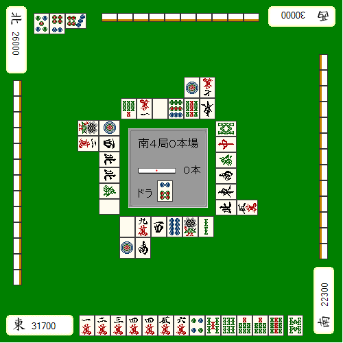
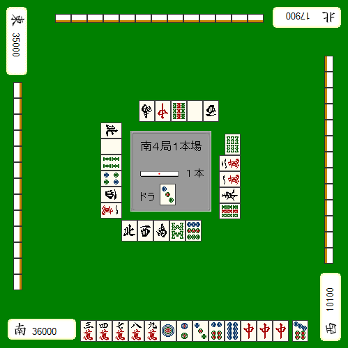

# 状况判断 8—ALL LAST 的战术（二）
这一节讲 AL 的立直判断。
在 AL，平常时候应该立直的牌根据状况不同也有需要自重的时候。
因为有时候你会白白扔一根棒子顺位反而下降。

例1：

特别是自己 TOP 迎来 AL 的情况。我们的目标是避免无效的立直结束牌局。
例1的牌2、5饼立直做满贯是平场的打法。
现在这样的点数状况就要默听，而且选择容易被打出的1、4索才是绝对的正确答案。

理论、总结：
AL 自己 TOP 有役听牌应该默听。
如果别人的牌只是没什么翻盘机会的食断的话，有时候有役也可以立，铳了也没关系。
不过这样的话就要有被第二位满贯直击也无法逆转的点差（自己扔棒子的话就要18000点），这样的机会根本就不怎么多。

例2：

AL 自己 TOP 应该果断进攻的情况就是很容易被第二位逆转的时候。和第二位微差自己还扔棒子自然很容易被逆转。
但是例2这样的情况自己立直就没什么问题，毕竟对家已经满足了逆转的条件了。

虽然4、7万可以默听和牌，但是更容易被打出的1万却因为没役不能和。
正在做食断的对家很有可能打出1万，即使默听，也没有什么有效的牌能够改变这样的状况了。所以这牌应该干脆的立直。

由于自己扔了棒子，可能会由于上下两家的自摸从而使自己的顺位下降。但是目前两家都还没有听牌，就不要想其他的，果断进攻！

例3：

例3讲如何应对4位的立直。

切中保持默听是比较正点的一手。
不管下家自摸什么牌都终局了，根本没有必要与其正面对决。
切掉中，自摸2、5万的就算走运了。摸到危险牌就继续拆中果断弃和。
弃和基本上就保住 TOP 的状况还扔棒子简直是蠢到家了。

最后再讲讲涉及到改良默听的一些东西。
AL 应该期待改良听牌的情况很少，几乎都是期待一发或者里宝牌会更好一点。

例4：

AL 自己2位，差一手就能够三色听牌。
一发中里宝或者自摸中1里宝就能够逆转的状况的话，即立是正确的。
特别是3900点以内的点差，默听是损失非常大的打法。
和摸6万的概率相比，一发或者中里宝的概率要更大，这个大家用常识就可以知道的。

如果必须要自摸满贯的话，可以默听等摸6万改良。
但是，在三色做成之前荣牌打出来当然是要和的。能够改良的牌只有一种，而且就算改良了也要和出高目。
太过于期待这种苛刻的条件也是需要禁止的。

（待续）