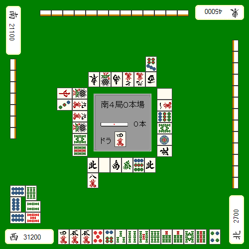
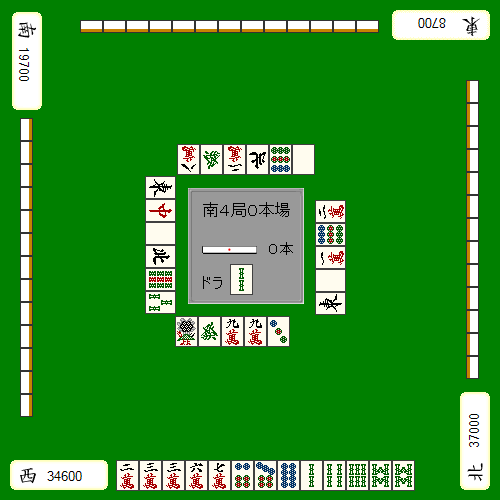
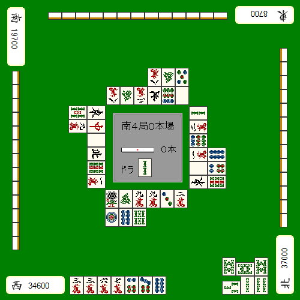
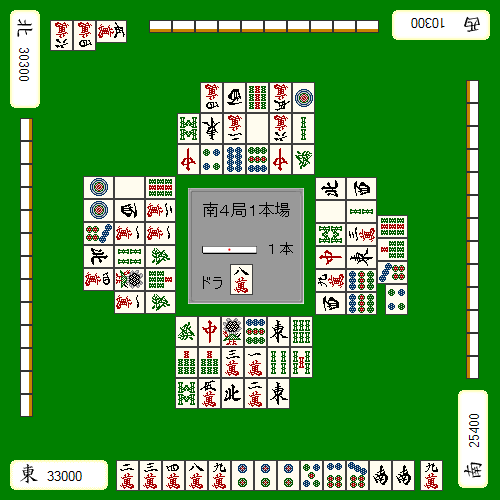
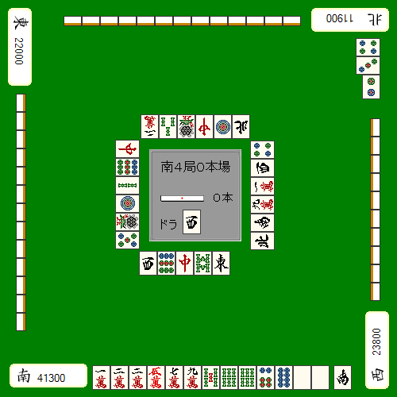

# 状况判断 9—ALL LAST 的战术（三）
在这一节举几个例子，介绍一下在 AL 的一些特殊战略和状况判断。
也不会有与例子完全一样的状况，重要的是要知道这些思考的方法。

不听牌的应用例子

 这样的牌是在平场就应该切掉宝牌立直。但是我们看看点数的情况。

满贯自摸也无法逆1（需要跳满自摸）
被上家满贯直击就跌到第3位

考虑到顺位和马，这里切掉宝牌的坏处比好处大。
这么一想，切掉5万不听牌。把两张宝牌都利用起来，索子形成雀头的话可以向着跳满自摸前进。
这是这一句最好的一手。

故意不和牌

故意不和牌是风险很大的行为，不过有时副露的手牌可以执行这个战略。

AL 和 TOP 的点差只有2400点，这个3索应该吃是没有什么问题吧。
手牌还有678三色的机会。

 之后，这个2000点的牌由对家打出了荣牌。
这张8万可别把牌给推了，
自摸或者直击就能够拿到 TOP，所以上家和对家打出的荣牌还是应该放过的。

不听宣言

AL 自己是 TOP，如果自己交未听罚符也能够 TOP 确定的话，
宣言未听从而让牌局结束也是不错的判断。
只有一人没听牌能够缩小的点差是4000点。
如果点差在4000点以上，那么早早弃和流局也没有关系。

 局面如图，下家满贯自摸就能够逆转。自己则是一个无役听牌，上家则是现物连打，好像弃和了的样子。
只要上家最后打的不是危险牌，我们宣言未听是没什么问题的。运气不好的话，说不定上家还真听牌了。但是这样的点差继续打下去被下家逆掉的危险性还是很高的。

喂牌与故意放铳

自己一个人大 TOP 的时候，比较可怕的就是亲家的连庄。当然也没有过度在意的必要，
但是偶尔与他人联合起来，能够让自己的 TOP 率上升。

 例题如图，就要看你怎么看待下家的鸣牌了。
一般这种小牌是不足以逆转自己的，再看看和亲家的点数。这是一个为了保2位的副露。
如果你能看明白这个的话，那么帮帮下家就是比较好的判断。

从6索附近的中张牌开始切，让下家去和断幺，即使自己放铳也没什么问题。

（待续）